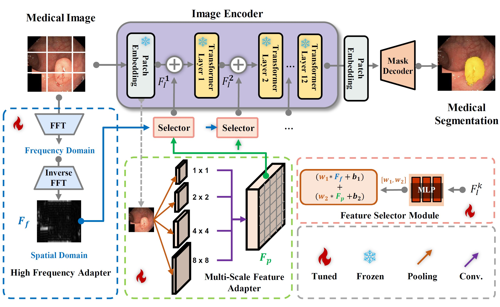
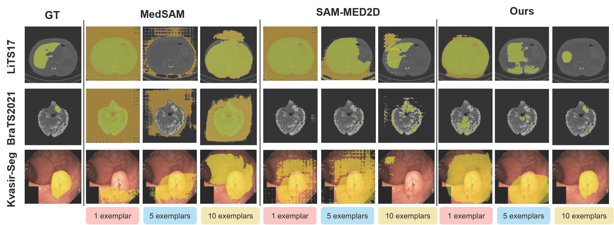

## Few Exemplar-Based General Medical Image Segmentation via Domain-Aware Selective Adaptation

Chen Xu, Qiming Huang, Yuqi Hou, Jiangxing Wu, Fan zhang, Hyung Jin Chang, Jianbo Jiao

<a href='https://mix.jianbojiao.com/'> MIX, Machine Intelligence + x, School of Computer Science, University of Birmingham. </a> Our group mainly studies machine learning and computer vision, and also interested in other applied machine learning problems including multimodal data, neuroscience, healthcare, physics, chemistry, to name a few. That is where the x lies in.

This work has been accepted by ACCV 2024 Conference. 🚀

<a href='https://github.com/xuchenjune/FEMedSegment'></a>
## 



Medical image segmentation poses challenges due to domain gaps, data modality variations and dependency on domain knowledge or experts, especially for low- and middle-income countries (LMICs). Whereas for humans, given a few exemplars (with corresponding labels), we are able to segment different medical images even without extensive domain-specific clinical training. In this paper, we investigate this capability gap and provide a solution to bridge the gap. Specifically, with access to only a few (e.g. less than 5) exemplars, we propose a domain-aware selective adaptation approach to adapt the general knowledge learned from a large model trained with natural images, to the corresponding medical domains/modalities, similar to how humans do. In contrast to prior approaches that either fine-tune pre-trained models with the whole medical dataset in a fully-supervised manner, we only need supervision from a few exemplars, and do not need to fine-tune the full model. Our approach addresses the performance gap between natural and medical image segmentation in an efficient and LMICs-friendly manner. Extensive experimental analysis showcases the effectiveness of our approach, offering potential advancements in healthcare diagnostics and clinical applications in LMICs.

Paper Link:
<a href='#'></a> 



Comparison from MedSAM, SAM-MED2D and our Few-MIS method (5-shot, 10-shot). The first column is the input image, the second column is the image with coloured ground truth masks, and the third and fourth columns are the image with coloured predicted masks by MedSAM and SAM-MED2D. The right 2 columns are the image with coloured predicted masks by our Few-MIS method.


## Environment
This code was implemented with Python 3.11 and PyTorch 2.3.0+cu121. You can install all the requirements via:
```bash
pip install -r requirements.txt
```


## Quick Start
1. Download the dataset and put it in ./Datasets, the code directory should under ./Codes. 
2. Preprocess the dataset by :
```bash
python dataset.py --dataset BraTS2021 --seed 2024 --slice_step 1
```
3. Pre-trained SAM(Segment Anything) ViT-Base will be automatically download before the training start.
4. Train:
```bash
python ./Codes/FEMedSegment/train.py --dataset BraTS2021 --epochs 5 --seed 2024 --patients 1 --test_fold fold_1 --patience_epochs 1 --model FEMed
```
5. Test:
    You can download trained model weight [here](https://drive.google.com/file/d/1nz4F2DwlJPHEd5qH12QNzFXw3GowPBdz/view?usp=drive_link) 
```bach
python ./Codes/FEMedSegment/test.py --dataset BraTS2021 --epochs 5 --seed 2024 --patients 1 --test_fold fold_1 --patience_epochs 1 --model FEMed --checkpoint model.pth
```
! The model may consume much memory. We use 4 x A100 graphics card for training. If you encounter the memory issue, please try to use graphics cards with larger memory!


## Dataset

### BraTS2021 - Brain Tumor MRI/3D
- **[BraTS2021 Dataset](https://www.kaggle.com/datasets/dschettler8845/brats-2021-task1/data)**

### LiTS - The Liver Tumor CT/3D
- **[LiTS17 Dataset](https://www.kaggle.com/datasets/andrewmvd/liver-tumor-segmentation)**

### Polyp Segmentation - Medical RGB/2D
- **[Kvasir Dataset](https://datasets.simula.no/kvasir-seg/)**


## Citation

If you find our work useful in your research, please consider citing:

```
@InProceedings{FEMed_2024_ACCV,
    author    = {Chen Xu, Qiming Huang, Yuqi Hou, Jiangxing Wu, Fan zhang, Hyung Jin Chang, Jianbo Jiao},
    title     = {Few Exemplar-Based General Medical Image Segmentation via Domain-Aware Selective Adaptation},
    booktitle = {Proceedings of the Asian Conference on Computer Vision (ACCV)},
    month     = {December},
    year      = {2024}
}
```

## Acknowledgements
Part of the code is derived from Explicit Visual Prompt by Weihuang Liu, [Xi Shen](https://xishen0220.github.io/), [Chi-Man Pun](https://www.cis.um.edu.mo/~cmpun/), and [Xiaodong Cun](https://vinthony.github.io/) by University of Macau and Tencent AI Lab. We would like to express our gratitude for their contribution. <a href='https://nifangbaage.github.io/Explicit-Visual-Prompt/'></a>


